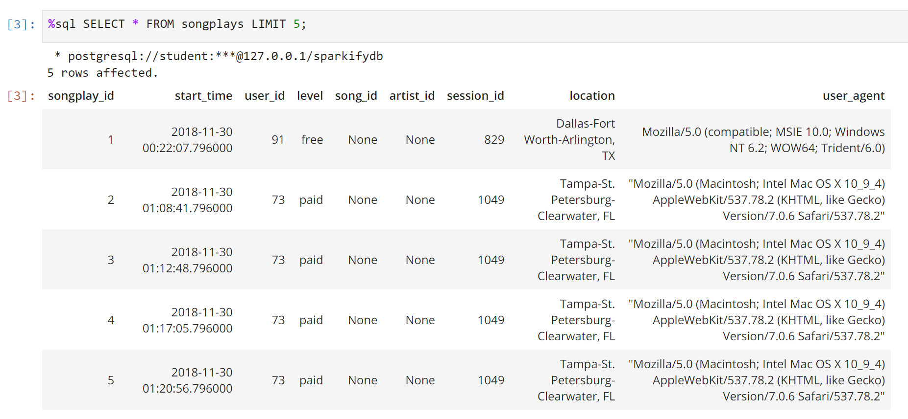

# DataEngineering-DataModelingWithPostgres

## Overview
A startup called Sparkify wants to analyze the data they've been collecting on songs and user activity on their new music streaming app. The analytics team is particularly interested in understanding what songs users are listening to. Currently, they don't have an easy way to query their data, which resides in a directory of JSON logs on user activity on the app, as well as a directory with JSON metadata on the songs in their app.  
In this case, we create a database schema and ETL pipeline for this analysis.  


## Data Source
### Song Dataset
The first dataset is a subset of real data from the <a href='http://millionsongdataset.com/'>Million Song Dataset</a>. Each file is in JSON format and contains metadata about a song and the artist of that song.  
An example of a single song file is like:  

```
{"num_songs": 1, "artist_id": "ARJIE2Y1187B994AB7", "artist_latitude": null, "artist_longitude": null, "artist_location": "", "artist_name": "Line Renaud", "song_id": "SOUPIRU12A6D4FA1E1", "title": "Der Kleine Dompfaff", "duration": 152.92036, "year": 0}
```

### Log Dataset
The second dataset consists of log files in JSON format generated by this <a href='https://github.com/Interana/eventsim'>event simulator</a> based on the songs in the dataset above. These simulate activity logs from a music streaming app based on specified configurations.  
An example of a single log file is like: 
```
{"artist":null,"auth":"Logged In","firstName":"Walter","gender":"M","itemInSession":0,"lastName":"Frye","length":null,"level":"free","location":"San Francisco-Oakland-Hayward, CA","method":"GET","page":"Home","registration":1540919166796.0,"sessionId":38,"song":null,"status":200,"ts":1541105830796,"userAgent":"\"Mozilla\/5.0 (Macintosh; Intel Mac OS X 10_9_4) AppleWebKit\/537.36 (KHTML, like Gecko) Chrome\/36.0.1985.143 Safari\/537.36\"","userId":"39"}
{"artist":null,"auth":"Logged In","firstName":"Kaylee","gender":"F","itemInSession":0,"lastName":"Summers","length":null,"level":"free","location":"Phoenix-Mesa-Scottsdale, AZ","method":"GET","page":"Home","registration":1540344794796.0,"sessionId":139,"song":null,"status":200,"ts":1541106106796,"userAgent":"\"Mozilla\/5.0 (Windows NT 6.1; WOW64) AppleWebKit\/537.36 (KHTML, like Gecko) Chrome\/35.0.1916.153 Safari\/537.36\"","userId":"8"}
{"artist":"Des'ree","auth":"Logged In","firstName":"Kaylee","gender":"F","itemInSession":1,"lastName":"Summers","length":246.30812,"level":"free","location":"Phoenix-Mesa-Scottsdale, AZ","method":"PUT","page":"NextSong","registration":1540344794796.0,"sessionId":139,"song":"You Gotta Be","status":200,"ts":1541106106796,"userAgent":"\"Mozilla\/5.0 (Windows NT 6.1; WOW64) AppleWebKit\/537.36 (KHTML, like Gecko) Chrome\/35.0.1916.153 Safari\/537.36\"","userId":"8"}
{"artist":null,"auth":"Logged In","firstName":"Kaylee","gender":"F","itemInSession":2,"lastName":"Summers","length":null,"level":"free","location":"Phoenix-Mesa-Scottsdale, AZ","method":"GET","page":"Upgrade","registration":1540344794796.0,"sessionId":139,"song":null,"status":200,"ts":1541106132796,"userAgent":"\"Mozilla\/5.0 (Windows NT 6.1; WOW64) AppleWebKit\/537.36 (KHTML, like Gecko) Chrome\/35.0.1916.153 Safari\/537.36\"","userId":"8"}
{"artist":"Mr Oizo","auth":"Logged In","firstName":"Kaylee","gender":"F","itemInSession":3,"lastName":"Summers","length":144.03873,"level":"free","location":"Phoenix-Mesa-Scottsdale, AZ","method":"PUT","page":"NextSong","registration":1540344794796.0,"sessionId":139,"song":"Flat 55","status":200,"ts":1541106352796,"userAgent":"\"Mozilla\/5.0 (Windows NT 6.1; WOW64) AppleWebKit\/537.36 (KHTML, like Gecko) Chrome\/35.0.1916.153 Safari\/537.36\"","userId":"8"}
{"artist":"Tamba Trio","auth":"Logged In","firstName":"Kaylee","gender":"F","itemInSession":4,"lastName":"Summers","length":177.18812,"level":"free","location":"Phoenix-Mesa-Scottsdale, AZ","method":"PUT","page":"NextSong","registration":1540344794796.0,"sessionId":139,"song":"Quem Quiser Encontrar O Amor","status":200,"ts":1541106496796,"userAgent":"\"Mozilla\/5.0 (Windows NT 6.1; WOW64) AppleWebKit\/537.36 (KHTML, like Gecko) Chrome\/35.0.1916.153 Safari\/537.36\"","userId":"8"}
{"artist":"The Mars Volta","auth":"Logged In","firstName":"Kaylee","gender":"F","itemInSession":5,"lastName":"Summers","length":380.42077,"level":"free","location":"Phoenix-Mesa-Scottsdale, AZ","method":"PUT","page":"NextSong","registration":1540344794796.0,"sessionId":139,"song":"Eriatarka","status":200,"ts":1541106673796,"userAgent":"\"Mozilla\/5.0 (Windows NT 6.1; WOW64) AppleWebKit\/537.36 (KHTML, like Gecko) Chrome\/35.0.1916.153 Safari\/537.36\"","userId":"8"}
{"artist":"Infected Mushroom","auth":"Logged In","firstName":"Kaylee","gender":"F","itemInSession":6,"lastName":"Summers","length":440.2673,"level":"free","location":"Phoenix-Mesa-Scottsdale, AZ","method":"PUT","page":"NextSong","registration":1540344794796.0,"sessionId":139,"song":"Becoming Insane","status":200,"ts":1541107053796,"userAgent":"\"Mozilla\/5.0 (Windows NT 6.1; WOW64) AppleWebKit\/537.36 (KHTML, like Gecko) Chrome\/35.0.1916.153 Safari\/537.36\"","userId":"8"}
{"artist":"Blue October \/ Imogen Heap","auth":"Logged In","firstName":"Kaylee","gender":"F","itemInSession":7,"lastName":"Summers","length":241.3971,"level":"free","location":"Phoenix-Mesa-Scottsdale, AZ","method":"PUT","page":"NextSong","registration":1540344794796.0,"sessionId":139,"song":"Congratulations","status":200,"ts":1541107493796,"userAgent":"\"Mozilla\/5.0 (Windows NT 6.1; WOW64) AppleWebKit\/537.36 (KHTML, like Gecko) Chrome\/35.0.1916.153 Safari\/537.36\"","userId":"8"}
{"artist":"Girl Talk","auth":"Logged In","firstName":"Kaylee","gender":"F","itemInSession":8,"lastName":"Summers","length":160.15628,"level":"free","location":"Phoenix-Mesa-Scottsdale, AZ","method":"PUT","page":"NextSong","registration":1540344794796.0,"sessionId":139,"song":"Once again","status":200,"ts":1541107734796,"userAgent":"\"Mozilla\/5.0 (Windows NT 6.1; WOW64) AppleWebKit\/537.36 (KHTML, like Gecko) Chrome\/35.0.1916.153 Safari\/537.36\"","userId":"8"}
{"artist":"Black Eyed Peas","auth":"Logged In","firstName":"Sylvie","gender":"F","itemInSession":0,"lastName":"Cruz","length":214.93506,"level":"free","location":"Washington-Arlington-Alexandria, DC-VA-MD-WV","method":"PUT","page":"NextSong","registration":1540266185796.0,"sessionId":9,"song":"Pump It","status":200,"ts":1541108520796,"userAgent":"\"Mozilla\/5.0 (Macintosh; Intel Mac OS X 10_9_4) AppleWebKit\/537.77.4 (KHTML, like Gecko) Version\/7.0.5 Safari\/537.77.4\"","userId":"10"}
{"artist":null,"auth":"Logged In","firstName":"Ryan","gender":"M","itemInSession":0,"lastName":"Smith","length":null,"level":"free","location":"San Jose-Sunnyvale-Santa Clara, CA","method":"GET","page":"Home","registration":1541016707796.0,"sessionId":169,"song":null,"status":200,"ts":1541109015796,"userAgent":"\"Mozilla\/5.0 (X11; Linux x86_64) AppleWebKit\/537.36 (KHTML, like Gecko) Ubuntu Chromium\/36.0.1985.125 Chrome\/36.0.1985.125 Safari\/537.36\"","userId":"26"}
{"artist":"Fall Out Boy","auth":"Logged In","firstName":"Ryan","gender":"M","itemInSession":1,"lastName":"Smith","length":200.72444,"level":"free","location":"San Jose-Sunnyvale-Santa Clara, CA","method":"PUT","page":"NextSong","registration":1541016707796.0,"sessionId":169,"song":"Nobody Puts Baby In The Corner","status":200,"ts":1541109125796,"userAgent":"\"Mozilla\/5.0 (X11; Linux x86_64) AppleWebKit\/537.36 (KHTML, like Gecko) Ubuntu Chromium\/36.0.1985.125 Chrome\/36.0.1985.125 Safari\/537.36\"","userId":"26"}
{"artist":"M.I.A.","auth":"Logged In","firstName":"Ryan","gender":"M","itemInSession":2,"lastName":"Smith","length":233.7171,"level":"free","location":"San Jose-Sunnyvale-Santa Clara, CA","method":"PUT","page":"NextSong","registration":1541016707796.0,"sessionId":169,"song":"Mango Pickle Down River (With The Wilcannia Mob)","status":200,"ts":1541109325796,"userAgent":"\"Mozilla\/5.0 (X11; Linux x86_64) AppleWebKit\/537.36 (KHTML, like Gecko) Ubuntu Chromium\/36.0.1985.125 Chrome\/36.0.1985.125 Safari\/537.36\"","userId":"26"}
{"artist":"Survivor","auth":"Logged In","firstName":"Jayden","gender":"M","itemInSession":0,"lastName":"Fox","length":245.36771,"level":"free","location":"New Orleans-Metairie, LA","method":"PUT","page":"NextSong","registration":1541033612796.0,"sessionId":100,"song":"Eye Of The Tiger","status":200,"ts":1541110994796,"userAgent":"\"Mozilla\/5.0 (Windows NT 6.3; WOW64) AppleWebKit\/537.36 (KHTML, like Gecko) Chrome\/36.0.1985.143 Safari\/537.36\"","userId":"101"}
```

## Schema
### Fact Table
**songplays** - records in log data associated with song plays i.e. records with page `NextSong`
- songplay_id
- start_time
- user_id
- level
- song_id
- artist_id
- session_id
- location
- user_agent

### Dimension Tables
**users** - users in the app
- user_id
- first_name
- last_name
- gender
- level

**songs** - songs in music database
- song_id
- title
- artist_id
- year
- duration

**artists** - artists in music database
- artist_id
- name
- location
- latitude
- longitude

**time** - timestamps of records in songplays broken down into specific units
- start_time
- hour
- day
- week
- month
- year
- weekday

## Project Files
1. `create_tables.py` drops and creates your tables. You run this file to reset your tables before each time you run your ETL scripts.
2. `etl.ipynb` reads and processes a single file from song_data and log_data and loads the data into your tables. This notebook contains detailed instructions on the ETL process for each of the tables.
3. `etl.py` reads and processes files from song_data and log_data and loads them into your tables. You can fill this out based on your work in the ETL notebook.
4. `sql_queries.py` contains all your sql queries, and is imported into the last three files above.

## How to Run

```
python create_tables.py 
python etl.py 
```

## Overview of the Final Table

